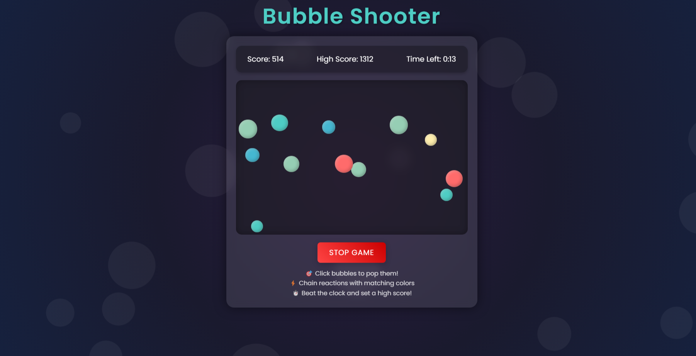

# 🎮 Bubble Shooter Game

A fun and interactive bubble shooter game built with vanilla JavaScript, featuring smooth animations, high score tracking, and chain reactions.



## 🌟 Features

- 🎯 Click-to-pop bubble mechanics
- 🎨 Beautiful color combinations
- ⚡ Chain reaction system for same-colored bubbles
- 🏆 Local storage high score tracking
- ⏱️ 60-second time challenge
- 🎪 Smooth animations and visual effects
- 📱 Responsive design

## 🚀 Quick Start

1. Clone the repository:
```bash
git clone https://github.com/yourusername/bubble-shooter.git
```

2. Navigate to the project directory:
```bash
cd bubble-shooter
```

3. Install dependencies:
```bash
npm install
```

4. Start the development server:
```bash
npm run dev
```

5. Open your browser and visit `http://localhost:5173`

## 🎮 How to Play

1. Click the "Start Game" button to begin
2. Click on bubbles to pop them
3. Popping bubbles near same-colored bubbles triggers chain reactions
4. Score points based on bubble size - smaller bubbles are worth more points
5. Try to beat your high score within the 60-second time limit

## 🛠️ Built With

- HTML5
- CSS3
- JavaScript (ES6+)
- Vite (Build tool)

## 📝 Game Rules

- Maximum of 12 bubbles on screen at once
- Chain reactions occur when same-colored bubbles are within range
- Smaller bubbles award more points
- Game ends after 60 seconds
- High score is saved locally

## 🔧 Development

To build for production:
```bash
npm run build
```

To preview the production build:
```bash
npm run preview
```

## 🤝 Contributing

1. Fork the repository
2. Create your feature branch (`git checkout -b feature/AmazingFeature`)
3. Commit your changes (`git commit -m 'Add some AmazingFeature'`)
4. Push to the branch (`git push origin feature/AmazingFeature`)
5. Open a Pull Request

## 📜 License

This project is licensed under the MIT License

## 🙏 Acknowledgments

- Inspired by classic bubble shooter games
- Built with modern web technologies
- Special thanks to the open-source community

## 📫 Contact

Developed by  -Vansh Bhardwaj & Manan Aggarwal
